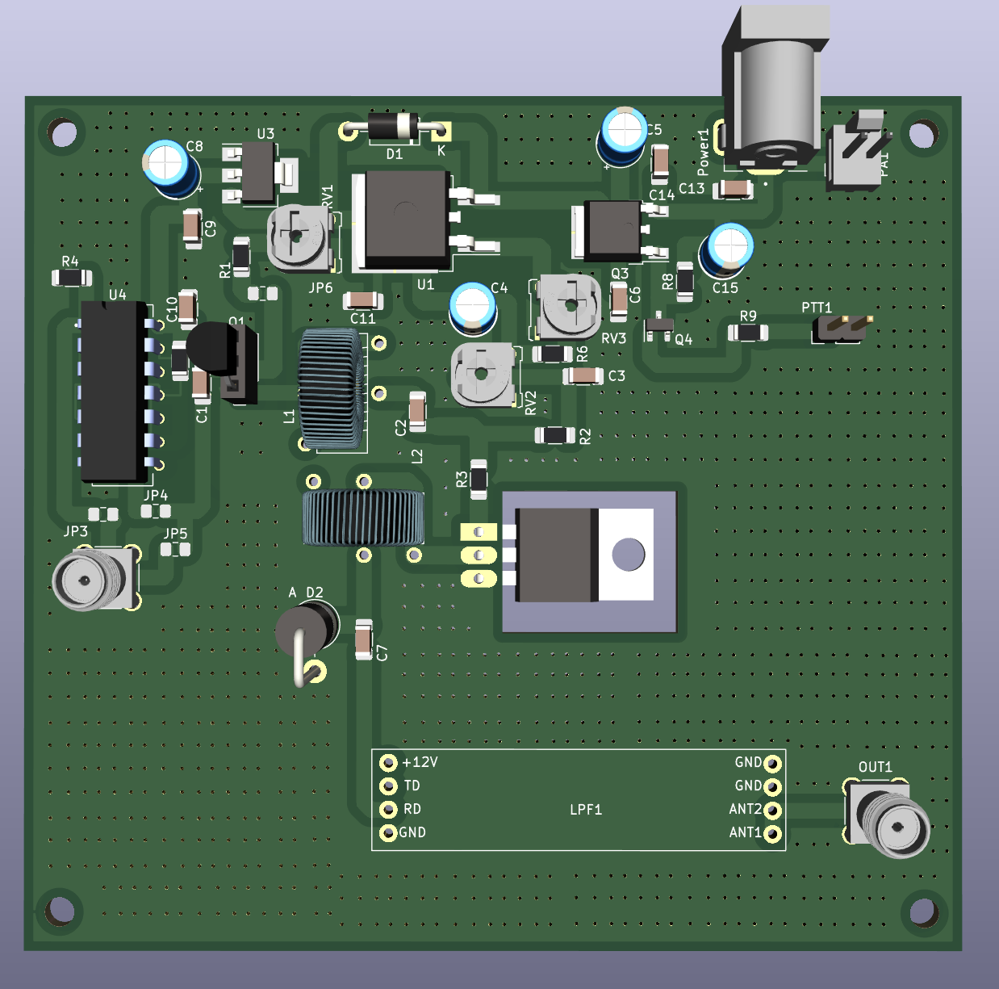

This work improves upon https://github.com/kholia/HF-PA-v6.

Central idea:

When driven by a Si5351 directly, the output of BS170 is mere 7 to 8 Vpp at 28
MHz.

When driven by a hex-inverter, the output of BS170 easily reaches 13 Vpp at 28
MHz.

This higher BS170 driver output is likely to produce better results (more power
and efficiency) from the IRF510 final @ 28 MHz.

Long-term TODO: Convert all components to SMD. The legs of the THT components
can be bent and fit on top of SMD pads!

- Pots - Bend legs

- Hex-inverter - Get the SMD version of the SN74ACT04N IC.

- BS170 - Bend legs

- Toroids - Bent the leads, stabilize using RTV silicone glue

- Electrolytic caps - Use SMD electrolytic caps

- Diode - Use SMD diode or bend the leads

- PTT - Use SMT pin header, if available?

With this technique the bottom of the PCB will be all ground. This makes
mounting the heat sink an easier problem.
